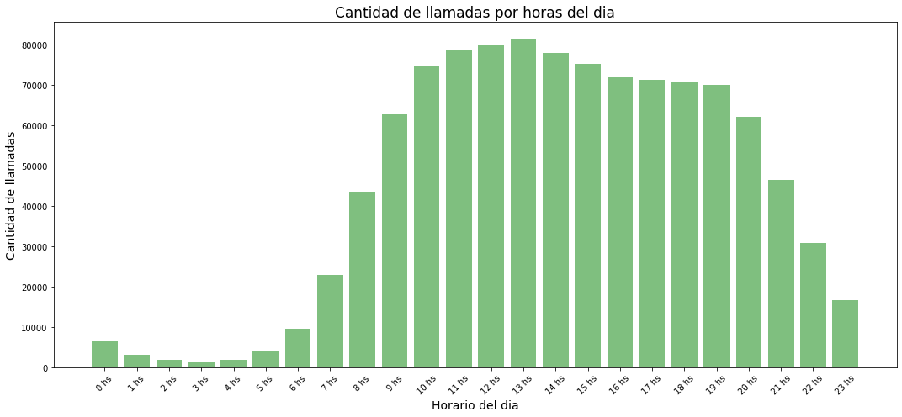

# Resolucion de Challenge para Gran Data

## Descripción
En este proyecto se resuelven 3 consignas practicas de desarrollo y codigo y 3 preguntas generales

## Instrucciones para Ejecutar el Proyecto
- Clonar el Repositorio o descomprimir el archivo rar en una carpera, luego en la terminal situarte en el path donde hayas descomprimido o bajado los archivos.
El siguiente paso es levantar la imagen de docker , para eso ejecuta el comando que te dejo acontinuacion, tener en cuenta que este paso es el que mas demora presenta recomiendo esperar y estar atento a la terminal por si arroja algun error : 

    docker-compose up --build  

- Una vez terminado de instalar las dependencias y cuando la sesion de Ubunto este activa dirigete al link que figura en la terminal, para asi poder ingresar al servicio de Jupyter Notebook que te redireccionara al Explorador por el puerto 8888 . Una vez dentro dirigete a la ruta : 127.0.0.1:8888/notebooks/challenge.ipynb

- Ya dentro del file: challenge.ipynb, inicialmente ejecuta solo la primera celda para confirmar el requisito tecnico principal y que la configuracion original no ha sufrido ningun cambio:

        Versión de Python : !python3 --version

        Versión de PySpark  import pyspark
                            print(pyspark.__version__)

Tiene que tener el siguiente ouput : Python 3.6 y Pyspark 3.2

Si es asi, ya puedes ejecutar el resto de celdas una a una, o todo el notebook completamente con run all. 
Una vez terminada la ejecucion debes tener como salida en cada celda lo siguiente :

## Paso 1: Monto Total a Facturar
El monto total a facturar por el proveedor por SMS es: **$ 140757.0**.

## Paso 2: Generar y exportar Dataset 
El dataset con los 100 clientes con mayor facturación ha sido generado y guardado en formato Parquet. La ruta a los archivos:
- [max_billing.parquet](datasets/output/max_billing) 

## Paso 3: Histograma de Llamadas por Horas
El histograma de llamadas por hora se generó y guardó como una imagen en formato PNG. La ruta al grafico es la siguiente:

- Una vez terminada la  ultima celda y guardado el grafico ,la sesion se Spark se cerrara, pero el servicio de jupyter sigue activo, para terminarlo, se debera volver a la consola del servicio y precionar Ctrl + C , y luego ejecutar el comando  :
             docker-compose down

Para asi terminar la sesion de Jupyter

